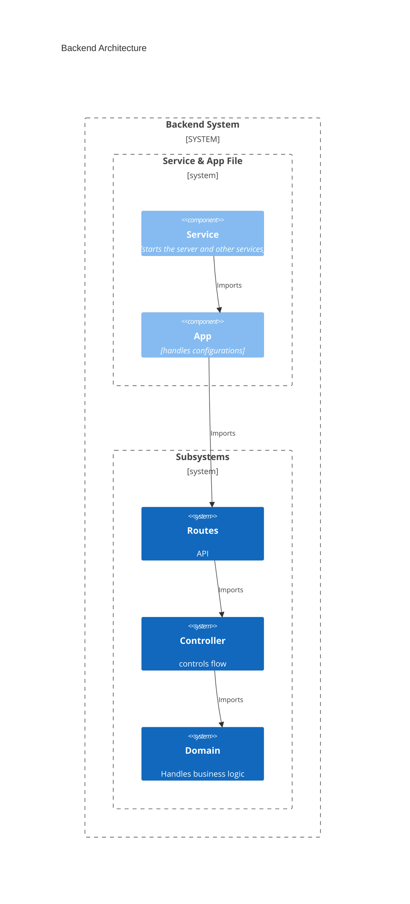

# edu-backend-velocity

## level-1

### part 1
```bash
cd ~
cd ws
rm -rf backend-velocity #Om den finns
mkdir backend-velocity
cd backend-velocity
npm init -y
mkdir src
touch ./src/service.js
touch ./src/app.js
npm pkg set scripts.start="node ./src/service.js"
npm pkg set scripts.dev="node --watch ./src/service.js"
npm install express
npm install dotenv
```
###  heredoc config.js

```bash
cat > ./src/config.js << 'EOF'
require('dotenv').config();
const PORT = process.env.PORT || 3000
module.exports = {PORT}
EOF
```

###  heredoc app.js

```bash
cat > ./src/app.js << 'EOF'
const express = require('express');
const app = express();
app.use(express.json());

app.get('/', (req,res) => {
    res.json({success: true});
}

module.exports = app;
EOF
```

###  heredoc service.js

```bash
cat > ./src/service.js << 'EOF'
const { PORT } = require('./config');
const app = require('./app.js');
let favicon = require('serve-favicon');
let path = require('path');

const PORT = process.env.PORT || 3000
app.use(favicon(path.join(__dirname, '../public', 'favicon.ico')))

app.listen(PORT, () => {
    console.log(`http server listening on port ${PORT}`)
});
EOF
```


### add to git
```bash
git init
git add .
git commit -m "Initial commit"
```



