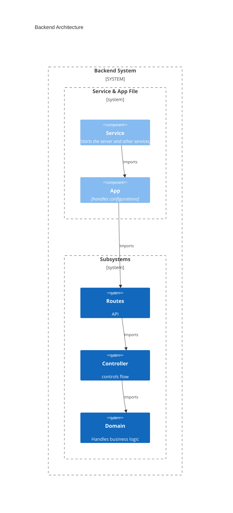

# edu-backend-velocity

```mermaid
C4Context
    title Backend Architecture

    UpdateLayoutConfig($c4ShapeInRow="1", $c4BoundaryInRow="1")

    System_Boundary(Backend, "Backend System") {
        Boundary(ServiceAppBoundary, "Service & App File") {
            Component(Service, "Service", "starts the server and other services")
            Component(App, "App", "handles configurations")
        }

        Boundary(Subsystems, "Subsystems") {
            System(Routes, "Routes", "API")
            System(Controller, "Controller", "controls flow")
            System(Domain, "Domain", "Handles business logic")
        }
        
    }

    
    Rel(Routes, Controller, "Imports")
    Rel(Controller, Domain, "Imports")
    Rel(Service, App, "Imports")
    Rel(App, Routes, "Imports")
```
